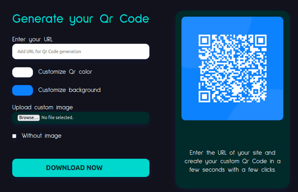

# Qr Code Generator





### About App

A lightweight and easy-to-use web application for generating QR codes. Built with modern JavaScript frameworks, this app allows users to quickly generate and download QR codes for URLs, text, and more. The project showcases efficient client-side development, utilizing React for the frontend and providing a seamless user experience

Features: 
- Light / dark mode theme switcher
- Qr Code denieden Frontend Mentor profile link default on loading
- Dynamically generating the Qr Code as you type the URL
- Dynamically update the color and background of the Qr Code based on the customization input entered by the user
- Dynamically update the customized image of the Qr Code
- Removes the custom image of the Qr Code
- You can download the `.png` of the generated Qr Code


## My process

### Built with

- Semantic HTML5 markup
- CSS custom properties
- Grid & Flexbox
- [React](https://reactjs.org/) - Js library
- [QRCode.react](https://www.npmjs.com/package/qrcode.react) - Qr Code package
- [React Color](https://casesandberg.github.io/react-color/) - Color Pickers package


### Useful resources

- [QRCode.react](https://www.npmjs.com/package/qrcode.react)
- [React Color](https://casesandberg.github.io/react-color/)

## Getting Started

In order to view this project locally, you need to make sure you clone this repository and install it's dependencies.

### System Requirements

- [git][https://git-scm.com/] 2.31.1 or greater
- [node][https://nodejs.org/en/] 14.16.1 or greater
- [npm][https://nodejs.org/en/] 8.7.0 or greater

To check which versions you have installed you can run these commands:
```
git --version
node --version
npm --version
```
If requirements above are not installed in your computer, you'll need to install them. By clicking on them you can go to their website, which can lead you the way.

### Installation

- Clone the repository
  ```sh
  git clone https://github.com/feyuk/qr-gen.git
  ```
- Navigate to repository folder
  ```sh
  cd qr-gen
  ```
- Install npm packages
  ```sh
  npm install
  ```
- To run the app in the development mode run in the project directory: 
  ```sh
  npm start
  ```


